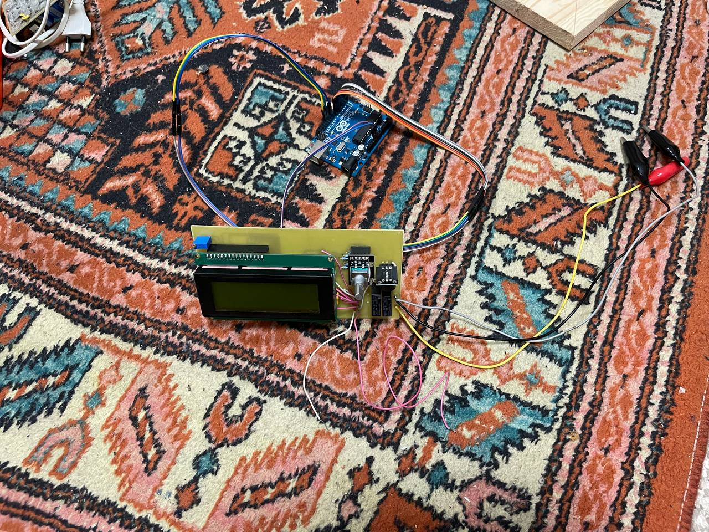

## HeavyMetal: Металлизатор отверстий печатных плат компактный.

HeavyMetal был изготовлен в рамках прохождения курса на `Физтех.Фабрике` .

В данном README предоставлена информация о разработке данного устройства.

### Постановка задачи

Для повышения качества печатных плат, изготавливаемых в домашних условиях, можно применять металлизацию отверстий: с помощью процесса электролиза на отверстия изготавливаемой печатной платы наносится слой меди. Металлизация отверстий повышает надежность, упрощает пайку и позволяет создавать многослойные печатные платы.

Цель работы: изготовить металлизатор отверстий печатных плат под кодовым названием HeavyMetal.

### Особенности тех. процесса

- Металлизация производится с помощью электролиза
- В ходе металлизации необходимо покачивать плату в электролите для удаления отработанной жидкости из металлизируемых отверстий.
- В зависимости от характеристик платы и электролита, процесс занимает от 15 до 60 минут.

### Концептуальная схема

Печатная плата П, являющаяся анодом, качается в электролите между катодами К1 и К2.

### Изготовление емкости для электролиза

Емкость для электролиза была изготовлена из оргстекла, скленного с помощью дихлорэтана. Фото емкости с медными катодами представлено ниже:

### Изготовление управляющей платы

Для управления устройством была изготовлена управляющая печатная плата. Плата контролируется чипом atmega-328p или arduino-uno.

На плате присутствуют следующие компоненты:
- LCD дисплей
- Энкодер с кнопкой
- Реле для управления электролизом
- Пьезо элемент
- Регулятор яркости экрана

Плата была спрототипирована на макетной плате, спроектирована в SprintLayout и изготовлена по ЛУТ технологии. Фото управляющей платы представлены ниже:

### Качающее устройство v1

Качающее устройство было смоделированно с помощью SolidWorks и напечатано на 3D-принтере. Принципиальная схема установки качающего устройства представлена ниже:

Однако, из эстетических соображений было принято решение не обрезать катоды для установки качающего устройства, а изготовить новое качающее устройтво из фанеры.

### Качающее устройство v2

Новое качающее устройство было спроектировано в CorelDraw и вырезано из фанеры.

Фото доработанного качающего устройства представлено ниже:

### Программирование

В среде разработки Arduino IDE был разработан код для управления металлизацией. У устройства есть 3 режима:

- _Режим настройки_ - в котором пользователь выбирает длительность процесса, и другие настройки. После завершения настройки, пользователь может перейти к режиму металлизации

- _Режим металлизации_ - в котором происходит непосредственно металлизация с заданными настройками.

- _Режим ожидания_ - после окончания металлизации устройство останавливает процесс, издает звуковой сигнал и переходит в режим ожидания

Код представлен в файле heavy_metal.ino

### Полученные результаты

Работа собранного устройства была успешно протестирована.

В ходе тестовой металлизации в домашних условиях удалось получить в среднем 75% полностью металлизированных отверстий. Что соответствует поставленным целям.
